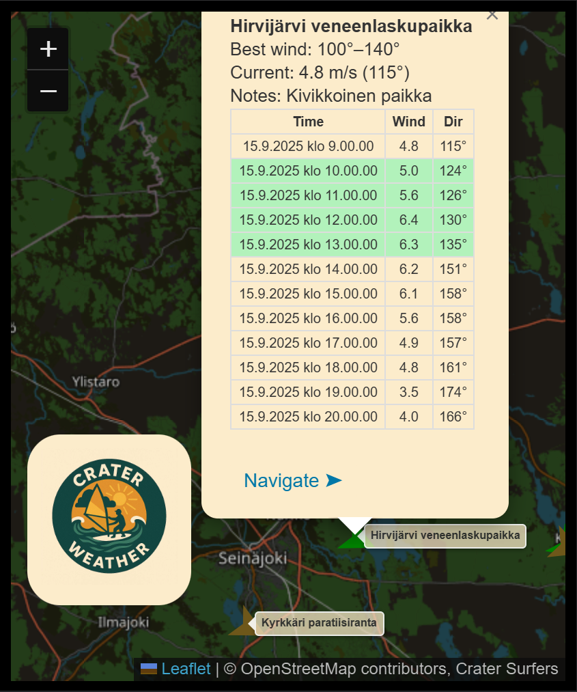

# Crater Weather


<https://naapurinpojat.github.io/CraterWeather>

## Design prequisites

- Windsurfers needed a clear way to check weather.
- Knows surf spots.
- No-go zones
- Easy application
- Zero backend

## Adding new spots

- Open geojson.io and define places
- update spots.geojson

## Features



## Development server using BUN

To install dependencies:

```bash
bun install
```

To run:

```bash
bun run
```

This project was created using `bun init` in bun v1.2.21. [Bun](https://bun.com) is a fast all-in-one JavaScript runtime.
