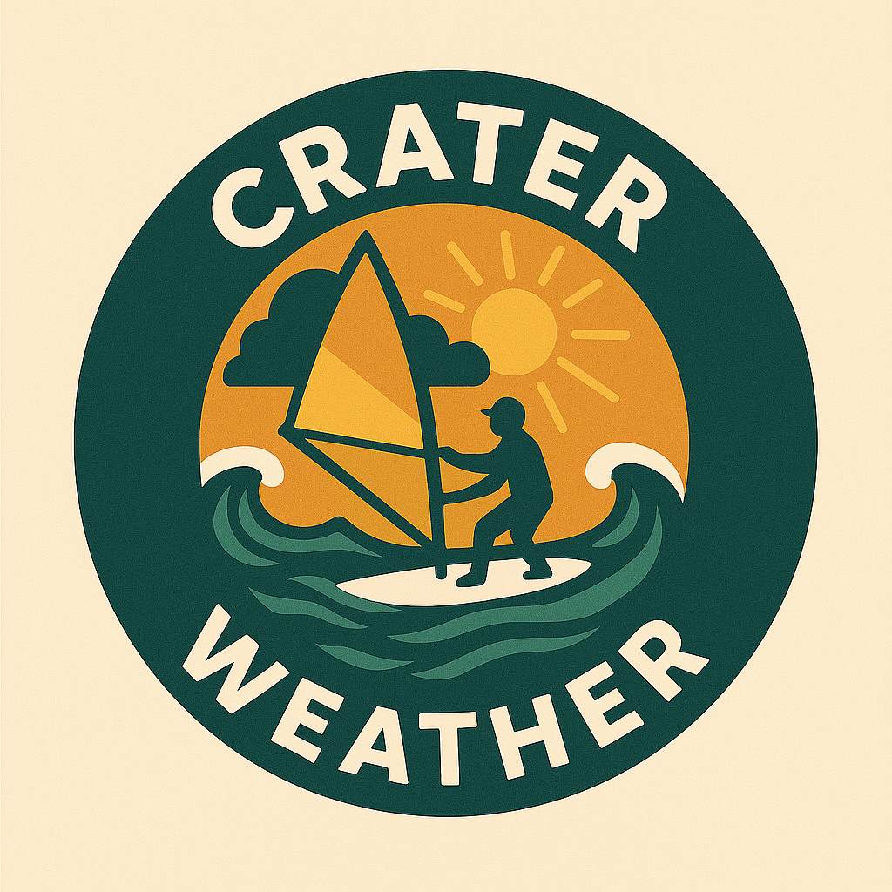
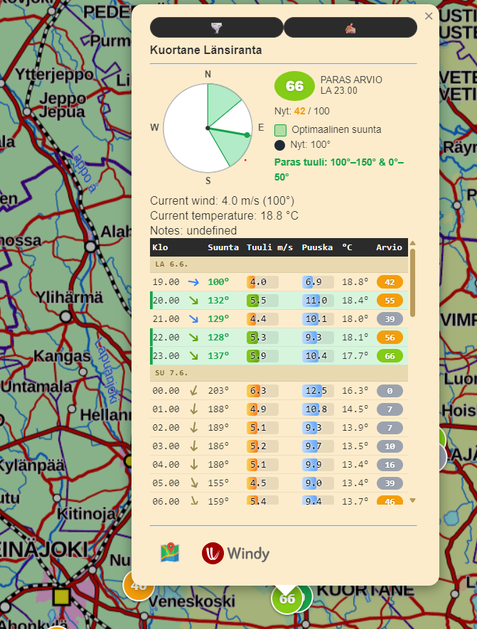

# Crater Weather



<https://naapurinpojat.github.io/CraterWeather>

## Design prerequisites

- Windsurfers needed a clear way to check weather.
- Knows surf spots.
- No-go zones
- Easy application
- Zero backend

## Features



- **Map of surf spots** for Finnish lakes, on the Maanmittauslaitos (MML) base map.
- **Surfability score (0–100)** per spot, combining wind direction, wind speed and gustiness (see below).
- **Score badges on the map** show the _best upcoming_ surfability across the whole forecast, so you can see at a glance where good weather is coming — green is great, gray is poor.
- **Spot popup** with:
  - a **compass** showing the spot's optimal wind direction sector(s) and the current wind,
  - the **best upcoming score** (and when) plus the current score,
  - a **48-hour forecast table** with wind/gust bars, per-hour score and the wind direction.
- **Sport selector** — windsurf, kitesurf, kitefoil and wingfoil, each with its own wind thresholds (your choice is remembered).
- **No-surf / hazard zones** drawn on the map (shallows, rocks, etc.).
- **Quick navigation** links to Google/Apple Maps and Windy for each spot.
- **Installable as an app** on Android and iOS — see below.

### Surfability score

The score (0–100) is `direction × speed × gust`:

- **Direction** — full marks when the wind is within the spot's optimal sector, with a smooth falloff outside it.
- **Speed** — ramps up to the active sport's "good" band and peaks near "very good"; very strong (overpowered) wind is gently penalised.
- **Gust** — steadier wind scores higher; a large gap between gusts and average wind lowers the score.

Switching sport in the side panel re-scores every spot.

## Install as an app (PWA)

Crater Weather is a Progressive Web App, so it can be added to your phone's home screen and launches full-screen like a native app (no app store needed).

- **Android (Chrome):** open the site → menu (⋮) → **Install app** / **Add to Home screen**.
- **iPhone / iPad (Safari):** open the site → **Share** → **Add to Home Screen**.

The app shell works offline; weather forecasts always require a connection.

## Adding new spots

- Open [geojson.io](https://geojson.io) and define the place (a `Point` for a spot, or a `Polygon` for a no-surf zone).
- Add the feature to `spots.geojson`. For spots, set `best_wind_dir` (one sector `[start, end]` or two `[s1, e1, s2, e2]`, degrees the wind comes _from_), optional `notes`, and `information` pointing to a markdown file.
- Add the matching `places/<slug>.md` with a free-form description shown in the spot's popup.

## Development server using BUN

To install dependencies:

```bash
bun install
```

To run (serves the static site on <http://localhost:3000>):

```bash
bun run dev
```

This project was created using `bun init` in bun v1.2.21. [Bun](https://bun.com) is a fast all-in-one JavaScript runtime.
